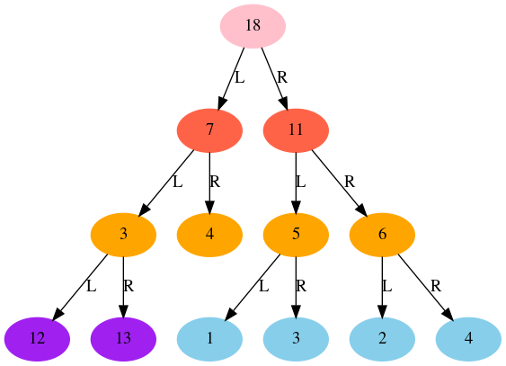
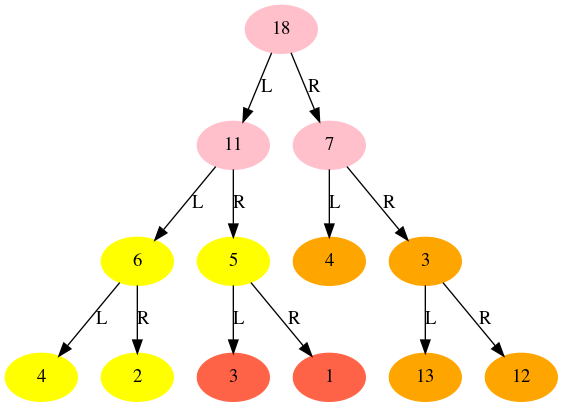

# Tree / B-Tree 二叉树

A binary tree is a hierarchical data structure which has at most two child nodes, i.e. no node in the tree can have a degree greater than two. For a binary tree, we distinguish between the subtree on the left and right as left subtree and right subtree respectively.

* Binary Trees are mostly used to store natural hierarchical data
* They provide moderate search, insertion and deletion speed.

## Breadth First Traversal

广度优先遍历，又称层次遍历，从树的根结点开始，从上到下从左到右遍历整个树的节点

## Depth First Traversal

深度优先遍历，对于一颗二叉树，深度优先遍历是沿着树的深度遍历树的节点，尽可能深地搜索树的分支。

深度优先遍历有三种重要的方法，这三种方式被用于访问树的节点，他们之间的不同在于访问每个节点的次序不同。这三种遍历分别叫做：
1. 先序遍历 (preorder)
2. 中序遍历 (inorder)
3. 后序遍历 (postorder)

## Tree Visualization

| tree | inverted |
| :--: | :--:     |
|  |  |

## Reference

* [Binary Tree Data Structure in Python](https://pyblog.in/programming/python/binary-tree-data-structure-in-python/)